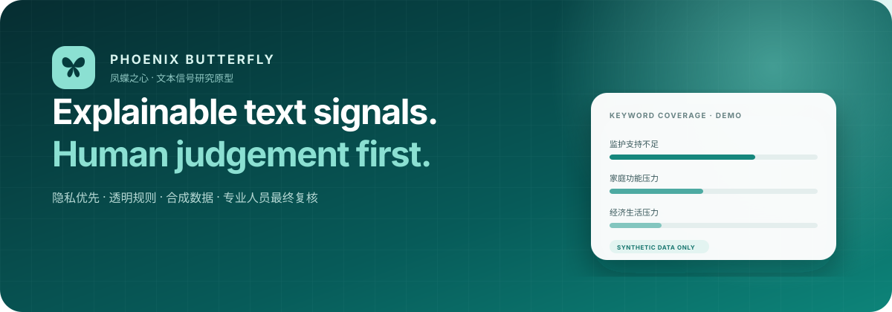
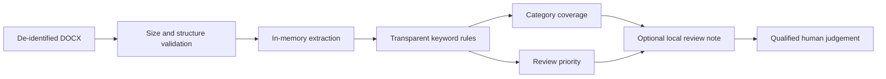

<p align="center">
  
</p>

<p align="center">
  <a href="README.md">简体中文</a> · <strong>English</strong>
</p>

<p align="center">
  <a href="https://github.com/wsLuYao/Multi-modal-AI-based-Dynamic-Mental-Health-Assessment-System-for-Children-in-Distressed-Circumstance/actions/workflows/ci.yml"></a>
  
  
  
  
</p>

> A privacy-conscious, explainable Chinese text-signal research prototype. It reads a de-identified DOCX locally, presents transparent rule matches, and leaves judgement to qualified people.

## Start with the facts

| Capability | Current status |
| --- | --- |
| Chinese DOCX text extraction | ✅ Implemented, in memory |
| Five keyword-coverage categories and review priority | ✅ Implemented, deterministic |
| Local printable HTML review note | ✅ Implemented, explicit disk-write opt-in |
| Voice, image, micro-expression, scale, or behavioral-stream input | **Not implemented** |
| Validated clinical model or accuracy claim | **None** |

This project is not a medical device, psychometric instrument, or clinical decision system. Do not use it for automated diagnosis, standalone screening, crisis conclusions, discipline, service eligibility, or resource allocation. Its “text-signal indicator” and “review priority” are software-demo values—not disease probabilities or clinical risk levels.

## Highlights

- **Private by default:** uploads are not written to disk, raw text is not returned, and neither history nor HTML notes are persisted unless explicitly enabled.
- **Explainable outputs:** each category traces back to a small visible lexicon; semantics are documented in the [model card](docs/model-card.md).
- **No black-box service:** no cloud API, credential, or telemetry is needed for the core flow.
- **Demo separated from evidence:** the static dashboard says when data are synthetic and makes no accuracy or operational-scale claim.
- **Verifiable:** unit/integration tests, a publish-tree privacy audit, Python lint, and JavaScript syntax checks run in CI.

## Quick start

Python 3.10–3.12 is recommended. Use the bundled synthetic material only.

```bash
git clone https://github.com/wsLuYao/Multi-modal-AI-based-Dynamic-Mental-Health-Assessment-System-for-Children-in-Distressed-Circumstance.git
cd Multi-modal-AI-based-Dynamic-Mental-Health-Assessment-System-for-Children-in-Distressed-Circumstance

python -m venv .venv
# Windows: .venv\Scripts\activate
# macOS/Linux: source .venv/bin/activate
python -m pip install -e ".[desktop]"

python scripts/make_demo_docx.py
phoenix-assessment
```

The script creates `runtime/synthetic_case.docx`; the entire runtime directory is ignored by Git.
The application writes neither history nor HTML notes by default. If a local printable note is necessary, read the [data and ethics guide](docs/data-and-ethics.md) and explicitly set `PHOENIX_WRITE_REPORTS=1`.

To view the backend-free visual prototype:

```bash
python -m http.server 8000 --directory prototypes/dashboard
```

Open `http://localhost:8000`. Every displayed value is a fixed synthetic placeholder.

## How it works



Category coverage is “matched configured terms ÷ terms in that category.” Categories are independent, so values are **not probabilities and need not sum to one**. A separate heuristic indicator combines a few emotion terms, first-person occurrences, text length, and urgent-review terms. It has no clinical threshold. Read the [model card](docs/model-card.md) and [architecture](docs/architecture.md) for precise boundaries.

## Repository map

```text
.
├─ src/phoenix_assessment/   # Python core, pywebview bridge, desktop UI
├─ prototypes/dashboard/     # Synthetic-data-only visual concept
├─ examples/                 # Fully synthetic text
├─ scripts/                  # Demo-DOCX generator and publish-tree audit
├─ tests/                    # Unit and end-to-end tests
├─ docs/                     # Architecture, model card, ethics, migration notes
└─ .github/                  # CI and contribution templates
```

## Test

```bash
python -m pip install -e ".[dev]"
ruff check .
python scripts/audit_publish_tree.py
pytest
```

## Data and ethics

No real-person data, prior history, generated report, temporary case document, patent application, or training dataset is included. Development, screenshots, tests, and issues must use synthetic material. A real-data deployment would require a lawful basis, consent/assent, de-identification, access controls, retention and deletion, ethics review, professional oversight, and crisis escalation. This repository does not supply those production controls.

Read the [data and ethics guide](docs/data-and-ethics.md), [security policy](SECURITY.md), and [prototype migration notes](docs/prototype-notes.md) before use.

## Roadmap

- [ ] Co-review the lexicon and interface with mental-health, child-safeguarding, data-governance, and usability experts
- [ ] Add negation, quotation, and context tests to reduce mechanical keyword errors
- [ ] Publish a fully synthetic cross-scenario evaluation set and error report
- [ ] Design auditable modality-adapter contracts (this does not mean multimodal support exists)
- [ ] Complete independent ethics, security, bias, and clinical-utility review before any real deployment

See [CONTRIBUTING.md](CONTRIBUTING.md). A change to rule semantics must update the algorithm version, model card, and tests.

## License

Code is released under the [Apache License 2.0](LICENSE). The license grants no third-party trademark rights and does not imply clinical, regulatory, or institutional endorsement.
