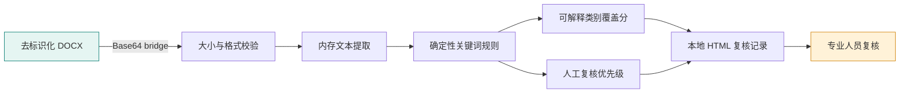

# Architecture / 架构说明

[中文](#中文) · [English](#english)

## 中文

当前版本是**文本信号研究基线**，由一个本地桌面壳、内存 DOCX 解析、确定性规则分析、HTML 复核记录和会话级历史组成。它没有实现语音、图像、微表情、心理量表或行为轨迹的采集与融合。

### 模块边界

| 模块 | 职责 | 明确不做 |
| --- | --- | --- |
| `document.py` | 校验 Base64、5 MiB 大小上限、DOCX 结构；在内存中提取段落与表格 | 不保留上传文件 |
| `analysis.py` | Unicode 归一化、关键词覆盖、启发式文本信号指标 | 不输出诊断或模型置信度 |
| `storage.py` | 会话内历史；显式配置后才写入本地 JSON | 不连接云端数据库 |
| `reporting.py` | 转义动态内容，按显式配置生成本地可打印 HTML | 不生成临床报告；默认不写盘 |
| `api.py` | 校验字段并编排上述组件 | 不接收姓名等直接标识符字段 |
| `web/` | pywebview 用户界面 | 不调用远程 API |

### 隐私默认值

- 上传的 DOCX 从 Base64 解码后直接在内存中解析，不创建临时副本。
- 分析结果不包含原文。
- 历史默认仅存在于当前 Python 进程。
- HTML 记录默认关闭；只有显式设置 `PHOENIX_WRITE_REPORTS=1` 才会写入被 Git 忽略的 `runtime/reports/`。
- 只有显式设置 `PHOENIX_PERSIST_HISTORY=1` 才会创建 `runtime/history.json`。

### 多模态扩展契约（尚未实现）

未来若增加音频、图像或量表适配器，应将各模态转换为带来源、时间戳、缺失状态和质量标记的标准化 `Signal`，再进入单独且可审计的融合层。任何扩展都必须具备同意管理、访问控制、保留期限、删除机制、偏差评估和人工覆核路径，不能只增加一个上传入口便宣称“多模态评估”。

## English

The current release is a **text-signal research baseline**: a local desktop shell, in-memory DOCX extraction, deterministic rules, a printable HTML review note, and session-scoped history. Audio, image, facial-expression, psychometric-scale, and behavioral-stream ingestion or fusion are not implemented.

The boundaries in the table above are deliberate: no uploaded document is persisted, no raw text is returned, history is ephemeral by default, HTML-note output requires `PHOENIX_WRITE_REPORTS=1`, dynamic fields are escaped, and the application makes no network request. Any future modality adapter needs an auditable signal contract plus consent, access control, retention, deletion, bias evaluation, and human override.
